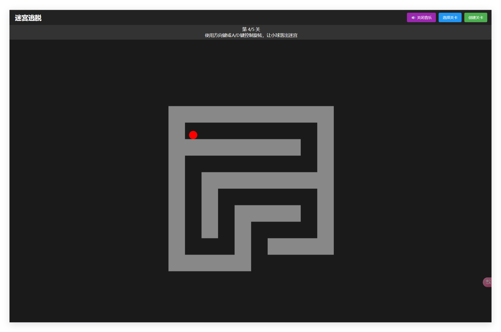
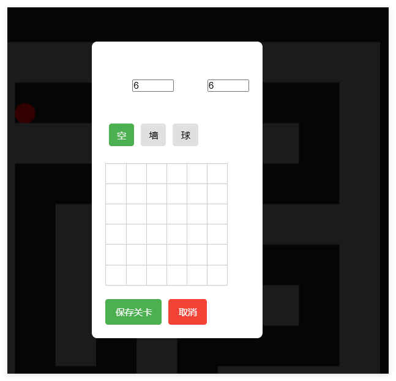

# Fall Escape

一个基于物理的迷宫游戏，使用 React + Matter.js + PIXI.js 开发，并且支持自定义关卡。

[在线预览](https://fall-escape-react.vercel.app/)

## 游戏规则

你需要控制迷宫旋转，让小球滚到出口。

## 操作

- 按住A/D键旋转迷宫

## 音乐

游戏开始自动播放BGM，音乐来自 [pixabay](https://pixabay.com/sound-effects/relaxing-guitar-loop-v5-245859/)
